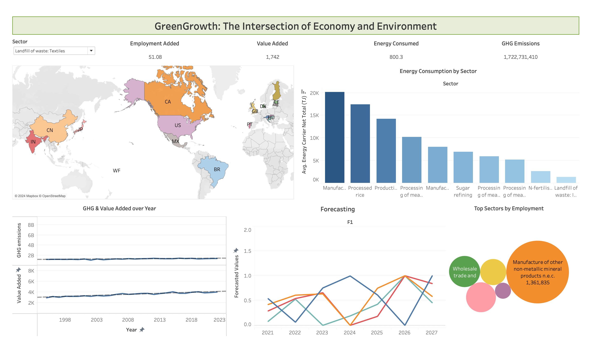

# GreenGrowth
GreenGrowth: The Intersection of Economy and Environment examines the link between economic activity and environmental impact from 1995 to 2022. Using interactive visuals, it analyzes sectoral contributions, trade-offs, and provides forecasts to support balanced, sustainable growth strategies.

The objective of GreenGrowth: The Intersection of Economy and Environment is to explore and illustrate the relationship between economic activities and environmental impacts across regions and sectors from 1995 to 2022. Through the use of interactive data-driven visualizations, the project aims to:

- Analyze the contribution of different sectors to both economic growth (value added, employment) and environmental degradation (GHG emissions, energy use)

- Investigate the trade-offs between employment creation and GHG emissions across regions and sectors

- Provide a future outlook for sustainable growth opportunities by forecasting GHG emissions, energy consumption, value added, and employment over the next 5-6 years

- Analyze the relationship between GHG emissions and value added over the years for a selected region, highlighting trends and changes to inform strategies that balance economic growth with environmental sustainability

Final Interactive Dashboard

